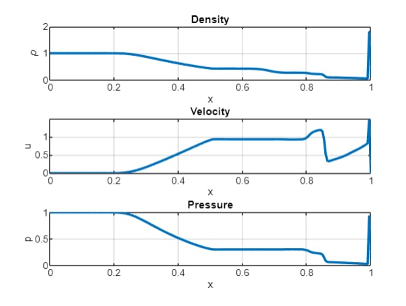

# 1. Godunov Scheme
## 1.1. Definition
- Piecewise Constant Approximation: Assuming that the solution at each time step is piecewise constant, dividing the domain into cells.
- Approximate Riemann Solver: At each cell interface, the scheme solves the Riemann problem.
- Finite Volume Formulation: The Godunov scheme is typically implemented in a finite volume framework, where the fluxes across the boundaries of each control volume are computed to update the cell-averaged values.
- First-Order Accuracy
- Upwind Nature
## 1.2. Properties
- Governed by conservation law
- Capture shock waves and discontinuities without introducing spurious oscillations
- Stable under CFL condition
- 1st-order Godunov scheme is monotone

# 2. Problem on Compressible Flows
## 2.1. Problem Statement (Sod's Shock Tube Problem - 1D Compressible Flow)
$$\frac{\partial}{\partial t} \begin{bmatrix} \rho\\
\rho u\\
E\\
\end{bmatrix} + \frac{\partial}{\partial x} \begin{bmatrix} \rho u\\
\rho u^2+p\\
u(E+p)\\
\end{bmatrix}=0$$

where $\rho$ is density, $u$ is velocity, $p$ is pressure, $E=\frac{p}{\gamma-1}+\frac{1}{2}\rho u^2$ is total energy per unit volume, with $\gamma$ is specific ratio.
## 2.2. Step-by-step solution
* Step 1: Domain discretization
Divide domain into $N$ cells with spatial step size $\Delta x$. Let cell averages of conserved quantities $(U)$ at time $t$ be:
$$U_i^n = \frac{1}{\Delta x} \displaystyle\int_{x_{i-\frac{1}{2}}}^{x_{i+\frac{1}{2}}} U(x,t^n)dx$$ where $U=[\rho, \rho u, E]^T$ is conserved variables. 
* Step 2: Solve Riemann problem
At each cell interface $x_{i+\frac{1}{2}}$, solve Riemann problem to determine the flux $F_{i+\frac{1}{2}}^n$:

$$F=\begin{bmatrix} \rho u \\
                  \rho u^2+p \\
                  u(E+p) \end{bmatrix}$$

The Riemann solver uses $U_L, U_R$ states at the interface.
* Step 3: Update the Conserved Quantities
$$U_i^{n+1}=U_i^n-\frac{\Delta t}{\Delta x}\Big(F_{i+\frac{1}{2}}^n-F_{i-\frac{1}{2}}^n \Big)$$

where $\Delta t$ satisfies CFL condition: $\Delta t \le \frac{\Delta x}{\max(|u|+c)}$ with $c=\sqrt{\frac{\gamma p}{\rho}}$ speed of sound. 

It means that numerically,
* Step 0: Setting initial conditions of Sod's Shock Tube Problem. Domain $x \in [0,1]$, dividing into $N$ cells:

$$\rho(x,0) = \begin{cases} 1 \ \ \ x < 0.5 \\
                          0.125 \ \ \ x \geq 0.5
\end{cases}$$
$$u(x,0) = 0$$
$$p(x,0) = \begin{cases} 1 \ \ \ x < 0.5 \\
                        0.1 \ \ \ x \geq 0.5
\end{cases}$$

* Step 1: Compute initial cell averages for $U_i^n=[\rho_i, \rho_i u_i, E_i]^T$
* Step 2: Solve Riemann problem to find the flux $F_{i+\frac{1}{2}}^n$
* Step 3: Update conserved variables
* Step 4: loop via several epoches
## 2.3. Code
- Initial conditions: Sod's shock tube problem is initialized with higher density, pressure on the left side $(x<0.5)$ and lower density, pressure on the right side $(x \ge 0.5)$.
- Conservative variable $(U=[\rho, \rho u, E])$ are updated each time step.
- HLLC flux function computed the intercell flux using approximate wave speeds $(S_L, S_R, S^*)$ and conservative quantities by finite-volumn approach.
## 2.4. Result
- Density: A sharp discontinuity forms at the shock front, with a contact discontinuity and a rarefaction wave.
- Velocity: A jump in velocity across the contact discontinuity is observed.
- Pressure: The pressure remains constant across the contact discontinuity but shows a jump across the shock.

### 2.4.1. Density Plot $(\rho)$
Density diagram shows three distinct regions separated by a shock wave, a contact discontinuity, and a rarefaction wave:
- Rarefaction Wave (leftmost region): The density decreases smoothly as the rarefaction wave propagates to the left.
- Contact Discontinuity (middle region): A sharp jump in density separates the left and right states. This is not a true shock wave, as it involves only a discontinuity in density, not pressure or velocity.
- Shock Wave (rightmost region): The shock causes a sharp increase in density, moving to the right.

Initially, the density is 1.0 on the left and 0.125 on the right. Over time, the shock propagates to the right, compressing the gas and increasing the density behind the shock. The rarefaction wave expands to the left, decreasing the density in that region.
### 2.4.2. Velocity Plot $(u)$
Velocity diagram demonstrates the motion of the fluid caused by the pressure difference between the left and right sides of the tube. It transitions across three main regions:
- Left Side of the Rarefaction Wave: The fluid velocity is near zero (as it was initially stationary).
- Contact Discontinuity: It rises sharply due to the flow of gas from the high-pressure left region to the low-pressure right region.
- Right Side of the Shock: It drops slightly but remains constant behind the shock.

Initially, the velocity is 0 everywhere since the fluid is at rest. As the system evolves, the velocity increases in the rarefaction region and remains constant between the contact discontinuity and the shock.
### 2.4.3. Pressure Plot $(p)$
Pressure diagram represents how the pressure equilibrates due to the propagation of waves:
- Rarefaction Wave (leftmost region): The pressure decreases smoothly due to the expansion of the gas in the rarefaction region.
- Contact Discontinuity: The pressure remains constant across the contact discontinuity, as this is a property of solutions to the Euler equations.
- Shock Wave (rightmost region): The pressure increases sharply across the shock, reflecting the compression of the gas.

Initially, the pressure is 1.0 on the left and 0.1 on the right. Over time, the shock wave compresses the gas, leading to a significant increase in pressure behind the shock. The rarefaction wave reduces the pressure on the left side as it expands outward.

# 3. MUSCL Scheme
## 3.1. Definition
MUSCL (Monotonic Upstream-centered Schemes for Conservation Laws) scheme is a higher-order finite difference method that improves upon the first-order Godunov scheme by using a linear reconstruction of the conserved variables at each cell interface; which allows for better resolution of shocks and smooth regions, reducing numerical diffusion.
## 3.2. Key Steps for MUSCL Scheme
* Step 1: Reconstruction of the variables at the cell interfaces using a piecewise linear approximation.
* Step 2: Godunov's scheme is applied to the flux calculation using the reconstructed values.
* Step 3: Use of a second-order accurate time-stepping method.
## 3.3. Difference between MUSCL and Godunov schemes
* About basic concept:
  - Godunov Scheme: Godunov scheme is a first-order method. Computing fluxes at cell interfaces by solving the Riemann problem for each pair of neighboring cells. The solution at each cell interface is taken as the value of the conservative variables at the left or right state, resulting in a piecewise constant approximation.
  - MUSCL Scheme: MUSCL scheme is a higher-order method (typically second-order accurate in space and time). Improving upon the Godunov scheme by reconstructing the cell-averaged values at the interfaces, using a piecewise linear reconstruction. The reconstruction is done using the information from neighboring cells, allowing for better resolution of shocks and smooth regions, thus reducing numerical diffusion.
* Solution reconstruction:
  - Godunov Scheme: Solution is assumed to be piecewise constant within each cell. The value of the solution at the interface is simply taken as the value of the cell-averaged variable, either from the left or the right state; which results in a first-order accurate solution, meaning the shock and other discontinuities are captured but are somewhat smeared out.
  - MUSCL Scheme: Reconstructing the solution at each interface using a piecewise linear approximation of the conserved variables. This is done by using the cell-centered values and the differences between them to generate a linear profile across the cell; which gives a higher-order approximation of the solution and results in a more accurate capture of shock waves and smooth regions.
* Shock Capturing and Numerical Diffusion:
  - Godunov Scheme: Quite good at capturing shocks, but since it uses piecewise constant values, it tends to exhibit numerical diffusion, especially in smooth regions. The shock will be captured as a discontinuity, but the smooth regions may become diffused and inaccurate.
  - MUSCL Scheme: Improving shock capturing by using a higher-order representation (linear reconstruction), which reduces numerical diffusion in smooth regions. The shock is sharper and the smooth regions are better resolved.
## 3.4. Result
### 3.4.1. Density Plot $(\rho)$
- Rarefaction Wave: The density smoothly decreases from the left side toward the contact discontinuity. The transition is resolved with higher accuracy due to the second-order spatial reconstruction.
- Contact Discontinuity: A sharp but accurately resolved jump in density is observed at the middle of the domain. The steepness of the discontinuity is preserved, showing minimal numerical diffusion compared to the Godunov scheme.
- Shock Wave: The sharp increase in density at the rightmost part of the domain (shock) is well-resolved. The MUSCL scheme reduces smearing at the shock front compared to the first-order Godunov scheme.
### 3.4.2. Velocity Plot $(u)$
- Rarefaction Wave: The velocity increases smoothly from the left state toward the contact discontinuity, consistent with the expanding rarefaction wave.
- Contact Discontinuity: There is a nearly vertical transition in velocity at the contact discontinuity, showing the movement of the gas.
- Shock Wave: The velocity is constant behind the shock and decreases smoothly in front of it.
### 3.4.3. Pressure Plot $(p)$
- Rarefaction Wave: The pressure decreases smoothly in the rarefaction region as the wave propagates to the left.
- Contact Discontinuity: Pressure is constant across the contact discontinuity, which is correctly captured.
- Shock Wave: The pressure rises sharply at the shock front, demonstrating compression.

# 4. WENO Scheme
## 4.1. Definition
WENO (Weighted Essentially Non-Oscillatory) scheme is a high-order finite difference method commonly used to solve conservation laws. It is designed to resolve sharp gradients (such as shock waves) and avoid oscillations in smooth regions, making it ideal for problems involving discontinuities.
## 4.2. Key Steps for WENO Scheme
* Step 1: Reconstructing the solution at the interfaces using a weighted combination of multiple candidate stencils. It assigns higher weights to smoother regions and lower weights to regions near discontinuities.
* Step 2: Computing flux based on the reconstructed values at the interfaces.
* Step 3: Updating solution using the finite volume method, ensuring the conservation of mass, momentum, and energy.
## 4.3. Difference between MUSCL and WENO schemes
* Reconstruction:
  - MUSCL Scheme: Extending the Godunov scheme to higher-order accuracy by piecewise linear reconstruction of the solution in each cell. It uses slope limiters to prevent oscillations near discontinuities, ensuring monotonicity of the solution. The scheme interpolates the solution to reconstruct the left and right states at cell interfaces.
  - WENO Scheme: Using nonlinear weighted combinations of multiple stencils to achieve high-order accuracy. They reconstruct the solution using polynomials from several candidate stencils. Weights are chosen adaptively based on smoothness indicators to avoid oscillations near discontinuities while maintaining high-order accuracy in smooth regions.
* Discontinuities Handling:
  - MUSCL Scheme: Slope limiters are explicitly used to handle discontinuities and ensure that the reconstructed solution remains monotonic; which may lead to a slight reduction in accuracy or excessive diffusion near shocks or discontinuities.
  - WENO Scheme: Suppressing oscillations near discontinuities by adjusting the weights of the stencils based on smoothness indicators; which results in better shock resolution and less numerical dissipation compared to MUSCL.
