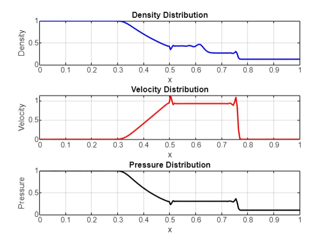

# 1. Raider–Parker Problem
This problem studies the behavior of one-dimensional, inviscid compressible flows. Its setup often resembles Sod's Shock Tube Problem, where a sudden discontinuity in density and pressure propagates through the domain, generating waves (shocks, rarefactions, or contact discontinuities). Mathematically, using the Euler equations for compressible flow:
- Mass Conservation (Continuity Equation):
$$\frac{\partial \rho}{\partial t} + \frac{\partial (\rho u)}{\partial x}=0$$
- Momentum Conservation:
$$\frac{\partial (\rho u)}{\partial t} + \frac{\partial (\rho u^2+p)}{\partial x}=0$$
- Energy Conservation:
$$\frac{\partial E}{\partial t} +\frac{\partial [(E+p)u]}{\partial x}=0$$

with $\rho$ is density, $u$ is velocity, $p$ is pressure, $E=\rho e+\frac{1}{2}\rho u^2$ is total energy per unit volumn, $e=\frac{p}{(\gamma-1)\rho}$ is internal energy per unit mass, $\gamma$ is ratio of specific heat.

# 2. Lax-Wendroff Scheme
Lax-Wendroff scheme is a second-order numerical method solving hyperbolic PDEs, combining Taylor expansion with FDM. For conserved variable $U(x,t)$, this scheme uses a second-order Taylor expansion in time:

$$U_i^{n+1}=U_i^n + \Delta t \frac{\partial U}{\partial t} + \frac{\Delta t^2}{2}\frac{\partial^2 U}{\partial t^2}$$

# 3. Solve Raider-Parker problem step-by-step
* Step 1: Define initial conditions for density $\rho$, velocity $u$, pressure $p$ in the domain. In this problem domain is often divided into 2 regions:
  - Left region: High density and pressure
  - Right region: Low density and pressure
* Step 2: Discretization
Divide spatial domain with step size $\Delta x$, choose time step $\Delta t$ based on CFL condition: $\Delta t=\text{CFL} \cdot \frac{\Delta x}{\max(|u|+c)}$ where $c=\sqrt{\frac{\gamma p}{\rho}}$.
* Step 3: Compute flux
Use Euler function to define flux vector $F(U)$:

$$F(U) = \begin{bmatrix} \rho u\\
        \rho u^2+p\\
        (E+p)u
        \end{bmatrix}$$

* Step 4: Predictor step
Compute the intermediate state at half-time steps $U_{i+\frac{1}{2}}^{n+\frac{1}{2}}$ using:

$$U_{i+\frac{1}{2}}^{n+\frac{1}{2}} = \frac{U_i^n+U_{i+1}^n}{2} - \frac{\Delta t}{2\Delta x}[F(U_{i+1})-F(U_i)]$$

* Step 5: Corrector step
Using predicted values to update solution:

$$U_{i+1}^n = U_i^n - \frac{\Delta t}{\Delta x}\Big(F_{i+\frac{1}{2}}^{n+\frac{1}{2}}-F_{i-\frac{1}{2}}^{n+\frac{1}{2}} \Big)$$

* Step 6: Update Primitive Variables (density, velocity, pressure, total energy)

# 4. Result explanation
## 4.1. Result

### 4.1.1. Density
- Shock Waves: The steep region is due to the high compression of fluid from the initial pressure and density jump. Lax-Wendroff resolves this but may exhibit slight oscillations near the shock due to its dispersive nature.
- Expansion Fan: The gradual slope arises as rarefaction waves spread the low-pressure region to the right.
- Contact Discontinuity: There may be a distinct "kink" in density, separating two regions without a change in velocity or pressure.
### 4.1.2. Velocity
- The velocity field captures the flow movement initiated by the pressure difference. Initially stationary regions are set into motion, creating regions of high and low velocities.
- Near the shock, the steep gradient indicates the rapid velocity change. The Lax-Wendroff scheme handles this transition moderately well but may introduce small oscillations.
- In the expansion fan, the velocity gradually increases (or decreases), as expected for rarefaction waves.
### 4.1.3. Pressure
- Shock Region: The pressure exhibits a steep gradient, representing the compressive effects of the shock. Oscillations may appear near this steep gradient due to the numerical dispersive properties of Lax-Wendroff.
- Expansion Fan: Pressure gradually decreases as the rarefaction waves reduce the density and internal energy of the fluid.
- Downstream Region: A nearly constant pressure indicates the uniformity achieved after the waves propagate away.
## 4.2. Observations
- Numerical Oscillations: Near the sharp discontinuities (shock and contact), small oscillations might appear in all three variables. This is a known limitation of the Lax-Wendroff scheme, which can be mitigated by using more advanced schemes like MUSCL or WENO.
- Resolution of Shock and Rarefaction: The shock wave is resolved sharply but not as well as higher-order schemes like WENO or Godunov with exact Riemann solvers. The expansion fan is smooth and well-resolved, showing the second-order accuracy of the scheme.
- Conservation Properties: Total mass, momentum, and energy are conserved globally, although small numerical errors may arise due to the finite difference approximations.
